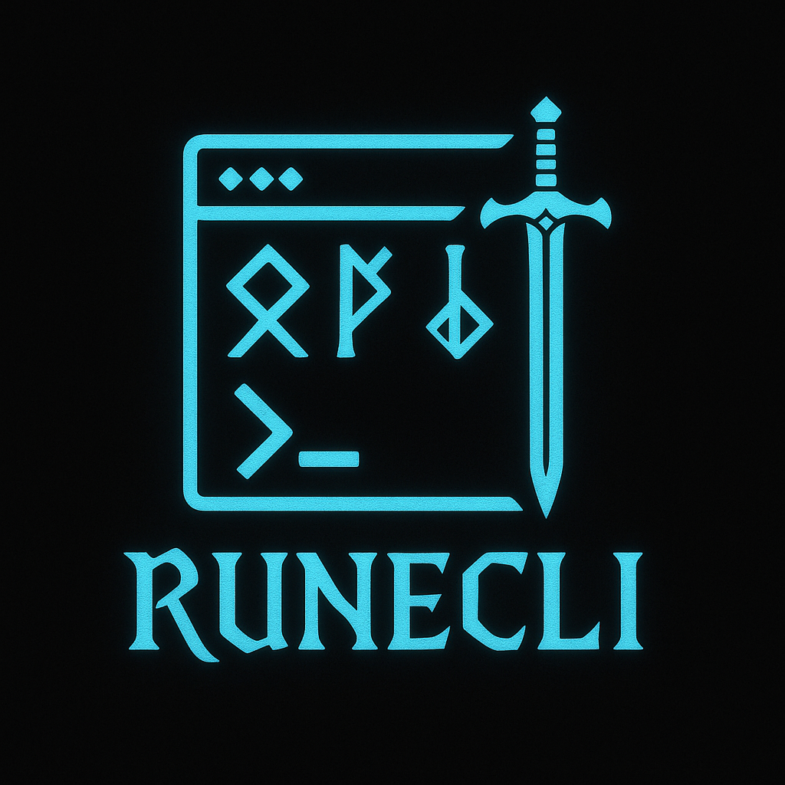

# RuneCLI

**RuneCLI** is a simple, terminal-based RPG written in modern C++ (C++17).  
You play as a lone warrior fighting monsters in turn-based combat.

## 🛡️ Features

- Basic combat system (action choice, turn-by-turn display, victory condition)
- Character classes that affect stats (e.g., Warrior, Mage)


## 🧱 Planned Features

- Save/load system
- Multiple dungeons
- Multiple attacks per character
- Diverse enemy types
- Random monster generation based on difficulty
- Shop system (equipment, potions)
- Inventory system (use scrolls, potions, etc.)
- Economy and loot drops
- Equipment system with stat effects

## 🛠️ Requirements

- A C++17-compatible compiler (e.g., `g++`)
- Linux-based OS (e.g., Ubuntu, Raspberry Pi OS)
    > ⚠️ Windows/macOS users: the Makefile might need to be adapted.

## 🏗️ Building the Project

To build the project:

```bash
make
```
To launch the game after compilation:

```bash
make go
```

To clean the build:

```bash
make clean
```


## 👨‍💻 Contributing

This is an open learning project. PRs and issues are welcome, especially if you want to help with features, structure, or game design!